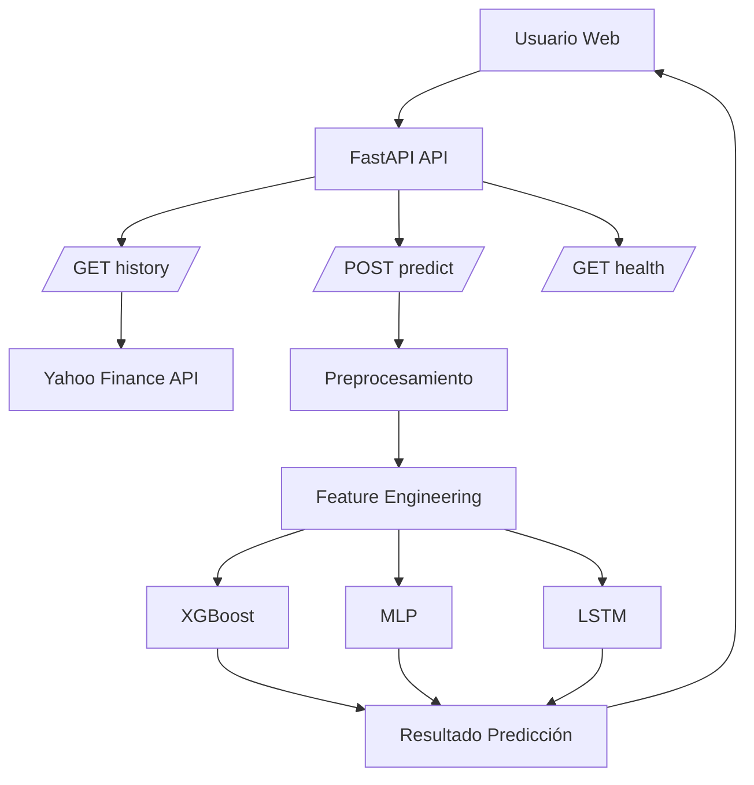
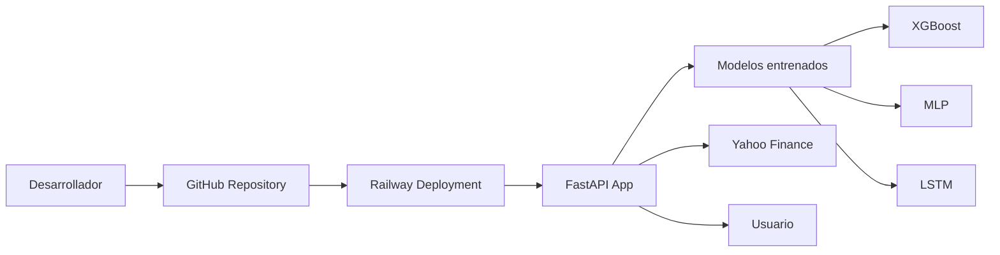

# Despliegue de modelos

## Infraestructura

- **Nombre del modelo:** AAPLPredict v0.1.0 – Predicción de retornos y volatilidad de AAPL
- **Plataforma de despliegue:** Railway Cloud Platform
- **Requisitos técnicos:**
- **Software**:
- Python
- Fast API
- Pandas Numpy
- Scikit-Learn
- XGBoost
- TensorFlow
- Optuna
- MLflow
- yfinance
- **Harduware minimo**:
- CPU
- Memoria Ram: 2 GB
- Disco duro: 5 GB
- GPU: No requerida.
- HTTP.
- Dependencias externas
- Acceso a Yahoo Finance para descarga de información financiera.
- Conectividad a Internet para la actualización de datos.

- **Requisitos de seguridad:**
- Conunicacion mediante HTTPS.
- Validación de datos mediante Pydantic
- Restriccion de archivos de acceso mediante static,
- No se almacenan credenciales de usuario.
- Protecciones de solicitudes mal formadas mediante validaciones FastAPI

- **Diagrama de arquitectura:**
  


Arquitectura de despliegue: 


## Código de despliegue


- **Archivo principal:** aaplpredict/api/main.py
- **Rutas de acceso a los archivos:**

```text
aaplpredict/
│
├── api/
│   ├── main.py              # API FastAPI (endpoints)
│   ├── predictor.py        # Lógica de inferencia (XGBoost, MLP, LSTM)
│   ├── schemas.py          # Modelos Pydantic (input/output)
│   └── static/
│       └── index.html      # Interfaz web
│
├── preprocessing/
│   └── main.py             # Limpieza y preparación de datos
│
├── training/
│   ├── feature_extraction.py  # Ingeniería de variables
│   ├── mejores_params.csv     # Hiperparámetros óptimos
│
├── models/
│   ├── xgboost_model.pkl
│   ├── mlp_model.pkl
│   └── lstm_model.keras
│
├── tests/
│   └── test_api.py
│
├── pyproject.toml
├── README.md
└── requirements.txt
```


- **Variables de entorno:** (lista de variables de entorno necesarias para el despliegue)


## Documentación del despliegue

- **Instrucciones de instalación:** (instrucciones detalladas para instalar el modelo en la plataforma de despliegue)
- **Instrucciones de configuración:** (instrucciones detalladas para configurar el modelo en la plataforma de despliegue)
- **Instrucciones de uso:** (instrucciones detalladas para utilizar el modelo en la plataforma de despliegue)
- **Instrucciones de mantenimiento:** (instrucciones detalladas para mantener el modelo en la plataforma de despliegue)
