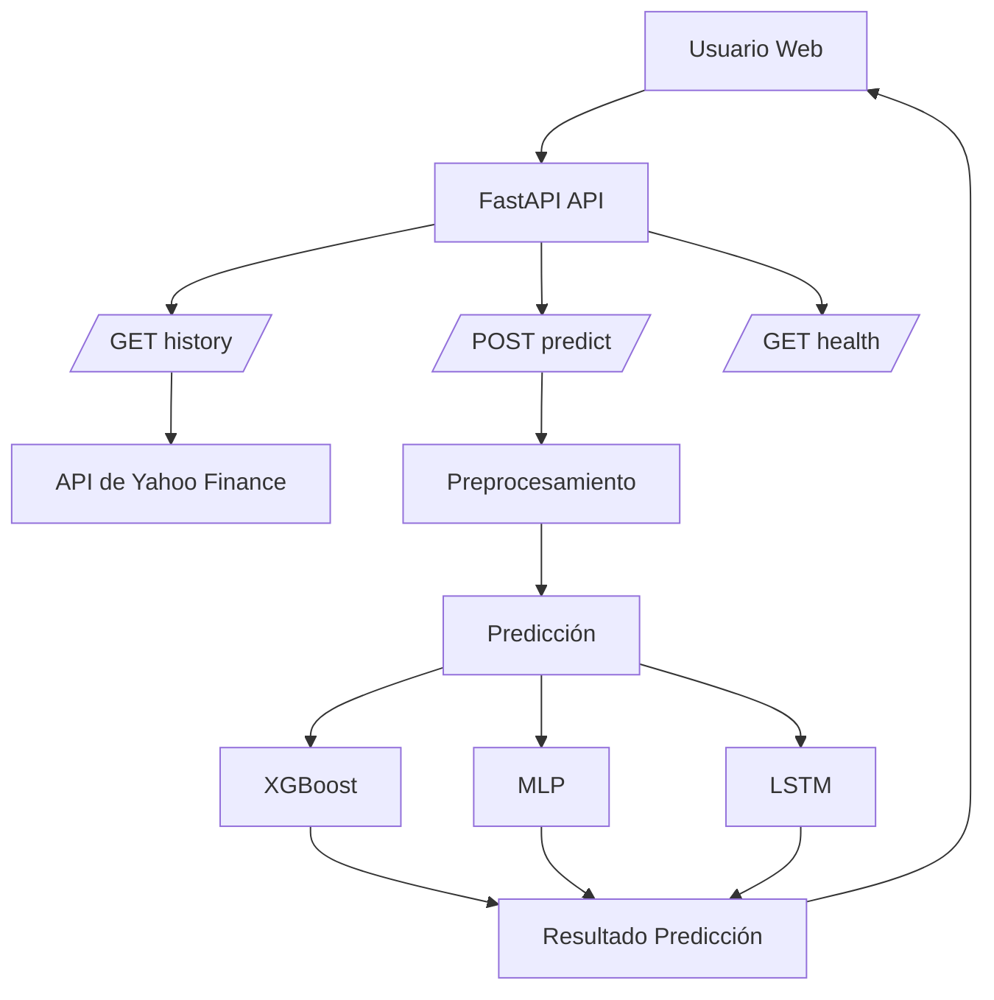
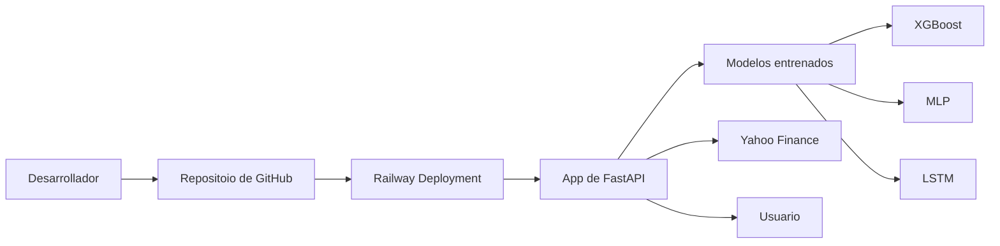

# Despliegue de modelos

## Infraestructura

- **Nombre del modelo:** AAPLPredict v0.1.0 – Predicción de retornos y volatilidad de AAPL
- **Plataforma de despliegue:** Railway Cloud Platform
- **Requisitos técnicos:**
- **Software**:
- Python
- Fast API
- Pandas Numpy
- Scikit-Learn
- XGBoost
- TensorFlow
- Optuna
- MLflow
- yfinance
- **Harduware minimo**:
- CPU
- Memoria Ram: 2 GB
- Disco duro: 5 GB
- GPU: No requerida.
- HTTP.
- Dependencias externas
- Acceso a Yahoo Finance para descarga de información financiera.
- Conectividad a Internet para la actualización de datos.

- **Requisitos de seguridad:**
- Conunicacion mediante HTTPS.
- Validación de datos mediante Pydantic
- Restriccion de archivos de acceso mediante static,
- No se almacenan credenciales de usuario.
- Protecciones de solicitudes mal formadas mediante validaciones FastAPI

- **Diagrama de arquitectura:**
  


Arquitectura de despliegue: 


## Código de despliegue


- **Archivo principal:** aaplpredict/api/main.py
- **Rutas de acceso a los archivos:**

```text
aaplpredict/
│
├── api/
│   ├── main.py             # API FastAPI
│   ├── predictor.py        # modelos (XGBoost, MLP, LSTM)
│   ├── schemas.py          # modelos Pydantic (input/output)
│   └── static/
│       └── index.html      # Interfaz web
│
├── preprocessing/
│   └── main.py             # Limpieza y preparación de datos
│
├── training/
│   ├── feature_extraction.py  # extraccion de datos
│   ├── mejores_params.csv     # OIptimizacion de Hiperparámetros 
│
├── models/
│   ├── xgboost_model.pkl
│   ├── mlp_model.pkl
│   └── lstm_model.keras
│
│
├── pyproject.toml
├── README.md
└── requirements.txt
```

- **Variables de entorno:**:

En Railway:

- PORT  
- RAILWAY_ENVIRONMENT  
- RAILWAY_PROJECT_ID  

---


## Documentación del despliegue

- **Instrucciones de instalación:**

## 1. Clonar el repositorio

```bash
git clone <https://github.com/davidSRA/proyecto_Modulo6_MLDS/tree/master/src/aaplpredict>
cd aaplpredict
```

---

## 2. Crear entorno virtual

### Windows
```bash
python -m venv venv
venv\Scripts\activate
```

### Linux / Mac
```bash
python -m venv venv
source venv/bin/activate
```

---

## 3. Instalar dependencias

```bash
pip install -r requirements.txt
```

o

```bash
pip install -e .
```

---

## 4. Verificación de instalación

```bash
python -c "import fastapi; print('OK')"
```


  
- **Instrucciones de configuración:**
## 1. Estructura de modelos

Debe existir la carpeta:

```text
models/
```

con los modelos:

- XGBoost  
- MLP  
- LSTM  

---

## 2. Variables de entorno

Opcionalmente:

```bash
MODELS_DIR=https://github.com/davidSRA/proyecto_Modulo6_MLDS/tree/master/models
```

En Railway:

- PORT  
- RAILWAY_ENVIRONMENT  
- RAILWAY_PROJECT_ID  

---

- **Instrucciones de uso:**

## 1. Ejecutar localmente

```bash
uvicorn aaplpredict.api.main:app --reload
```

URL:

```
http://127.0.0.1:8000
```

## 2. Endpoints

### 🔹 Health check

```http
GET /health
```

Respuesta:

```json
{
  "status": "ok"
}
```

---

### 🔹 Histórico

```http
GET /history?dias=45
```

---

### 🔹 Predicción

```http
POST /predict
```

Body:

```json
{
  "modelo": "XGBoost"
}
```

Modelos disponibles:

- XGBoost  
- MLP  
- LSTM  

---

## 3. Respuesta ejemplo

```json
{
  "modelo_usado": "XGBoost",
  "precio_actual": 210.5,
  "precio_1d": 211.2,
  "precio_5d": 214.8,
  "intervalo_5d_sup": 220.1,
  "intervalo_5d_inf": 209.3,
  "volatilidad_5d": 0.021
}
```


- **Instrucciones de mantenimiento:**

