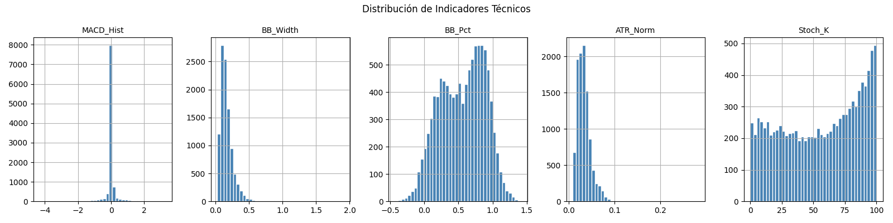
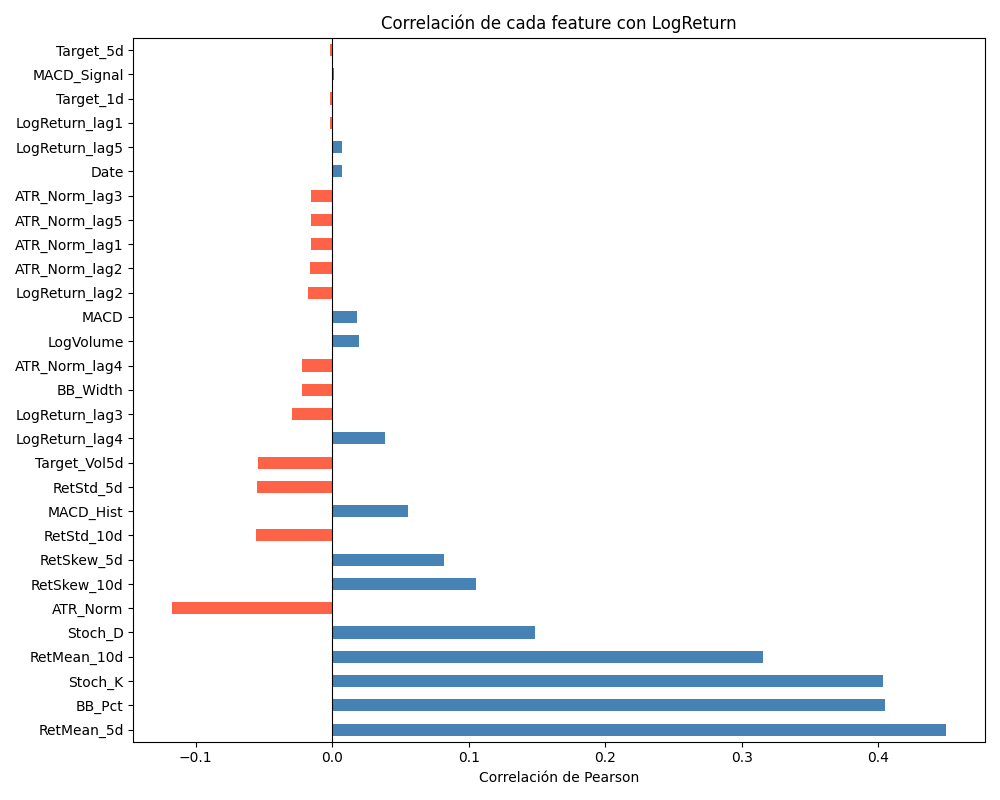

# Reporte del Modelo Baseline

El modelo base corresponde al primer enfoque desarrollado para la predicción de los log retornos retornos financieros utilizando distintas técnicas de machine learning relacioanadas al modelado y predicción de series de tiempo bursátiles o financieras. **El objetivo principal del modelo es establecer una línea base de desempeño para comparar posteriormente modelos más avanzados y configuraciones optimizadas**, lo anterior a traves del uso de diferentes librerias de Python para la optimización de hiperparametros como Optuna.

El pipeline implementado incluye:

1. Adquisición de datos financieros.
2. Preprocesamiento de precios y retornos.
3.Extracción de características técnicas y temporales.
4. Entrenamiento de modelos de mahcine learning aveces llamados de aprendizaje automático.
5. Evaluación del desempeño predictivo.

## Descripción del modelo

   
Los modelos considerados para el analisis de las series financieras, y que se consideran dentro de la linea base incluyen:

1. Redes neuronales MLP
2. XGBoost
3. Redes LSTM para secuencias temporales

## Variables de entrada

La principal variable de entrada es el precio de las acciones de APPLE.
Posteriormente, esta variable fue calculada los log retornos de acuerdo con la siguiente formula: 

$$LogReturn_t =
\ln\left(
\frac{P_t}{P_{t-1}}
\right)$$

donde,

$P_t$ es el precio en el tiempo actual.
$P_{t-1}$ es el precio del período anterior.
$\ln$ corresponde al logaritmo natural.

Posteriormente, a partur de esta variable, se construyeron otras variables variables de entrada, las cuales fueron construidas mediante técnicas conocidas del analisis de series de datos temporales para el suavizado de las series como, los promedios moviles, y sus diferentes versiones. En general las medias moviles, permiten sustraer o eliminar las variabilidad de la serie, para volverla una serie estacional y eliminar su volatilidad. Los indicadores calculados a partir de los log retornos son los siguientes:.

**Variables derivadas de los log retornos**
1. MACD (Moving Average Convergence Divergence)
2. MACD
3. MACD_Signal
4. MACD_Hist

**Elementos que capturan momentum y cambios de tendencia mediante medias móviles exponenciales.**
1. Bandas de Bollinger
2. BB_Width
3. BB_Pct

**Miden volatilidad relativa y posición del precio dentro de las bandas.**

1. ATR (Average True Range)
2. ATR_Norm

**Mide volatilidad real considerando gaps del mercado.**

1. Oscilador Estocástico
2. Stoch_K
3. Stoch_D

## Variable objetivo

   
Dentro del modelo de Machine Learning utilizado, Las variables objetivo utilizadas son:

1. Target_1d
2. Target_5d
3. Target_Vol5d

Donde:

Target_1d: Es el retorno esperado a 1 día.
Target_5d: Es el retorno acumulado esperado a 5 días.
Target_Vol5d: Es la volatilidad futura esperada en 5 días.

El principal objetivo del modelo corresponde al modelamiento y predicción de la variable de los retornos: Target_1d y Target_5d.

## Evaluación del modelo

   **Métricas de evaluación**: 

1. MSE (Mean Squared Error), la cual es una Métrica principal utilizada para optimización y Penaliza fuertemente errores grandes, su formula es:

**$$MSE=\frac{1}{n}\sum_{i=1}^{n}(y_i-\hat{y}_i)^2$$**

2. Coeficiente de Determinación ($R^2$): El coeficiente de determinación se calcula como: 

**$$ R^2 = 1 - \frac{\sum (y_i-\hat y_i)^2}{\sum (y_i-\bar y)^2} $$** 

Valores cercanos a 1 indican mejor ajuste del modelo.

### Resultados de evaluación

| Modelo | MSE | MAE | $R^2$ |
|---|---|---|---| 
| XGBoost | 0.000698 | 0.016723 | 0.113560 | 
| MLP | 0.000754 | 0.018160 | -0.139903 | 
| LSTM | 0.000772 | 0.018159 | -0.112977 |

El modelo MLP obtuvo el menor valor de MSE, alcanzando un error promedio de: $MSE_{MLP} = 0.001491$ lo que indica una mayor capacidad para capturar el comportamiento de la serie  financiera construida. El modelo LSTM presentó un desempeño muy cercano al MLP: $MSE_{LSTM} = 0.001506$ demostrando una adecuada capacidad para modelar dependencias temporales. Finalmente, XGBoost obtuvo: $MSE_{XGBoost} = 0.001690$

## Análisis de los resultados

   
El modelo XGBoost presentó el mejor desempeño general dentro de los demas modelos entrenados, obteniendo el menor error cuadrático medio y el único valor positivo del coeficiente de determinación. Esto sugiere que el modelo basado en árboles logró capturar de mejor manera la estructura de los datos financieros y presentar una mayor capacidad de generalización.

Los modelos MLP y LSTM presentaron desempeños cercanos entre sí, aunque con valores negativos de $R^2$, indicando limitaciones para explicar completamente la variabilidad de la serie financiera. A pesar de ello, las redes neuronales demostraron capacidad para capturar relaciones no lineales presentes en los retornos financieros.

## Conclusiones

   
Los resultados obtenidos a partir de los datos de entrenamiento muestran que:

* XGBoost presentó el mejor desempeño general.
* Las variables derivadas construidas mediante indicadores técnicos aportaron información relevante.
* Las redes neuronales requieren una optimización más cuidadosa para mejorar su capacidad de generalización.
* La naturaleza altamente volátil y no estacionaria de los mercados financieros representa un desafío importante para el modelamiento predictivo.

## Referencias

1. Chen, T., Guestrin, C. (2016). XGBoost: A Scalable Tree Boosting System.
2. Kingma, D., Ba, J. (2014). Adam: A Method for Stochastic Optimization.
3. Murphy, J. (1999). Technical Analysis of the Financial Markets.
4. Tsay, R. (2010). Analysis of Financial Time Series.
5. Chollet, F. (2021). Deep Learning with Python.
6. Optuna Developers. Optuna Documentation.

