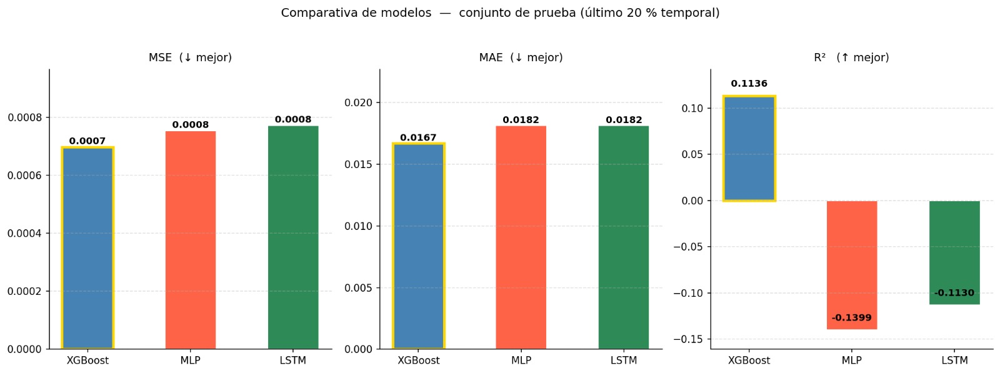

# Reporte del Modelo Final

El presente documento describe el desarrollo y evaluación del modelo final para predicción de variables financieras utilizando técnicas avanzadas de machine learning, deep learning y optimización de hiperparámetros. Dentro de la funcion principal *main* se han implementado tres modelo de machine learning para ajustar:

1. XGBoost
2. Redes neuronales densas (MLP)
3. Redes recurrentes LSTM

La optimización de hiperparámetros fue realizada utilizando Optuna, permitiendo optimizar simultáneamente la Arquitectura de modelos, 
Parámetros de entrenamiento, Configuración temporal de series financieras. La evaluación se realizó mediante validación cruzada temporal (TimeSeriesSplit) utilizando 5 folds para evitar filtración de información futura (data leakage). La métrica principal utilizada fue el error cuadrático medio (MSE)

## Descripción del Problema

El objetivo principal del proyecto consiste en predecir el comportamiento futuro de variables: **Retorno esperado a 1 día (Target_1d)**
y **Retorno esperado a 5 días (Target_5d**, variables financieras a partir de información histórica del mercado. Los mercados de los precios de las acciones de APPLE generalmente presentan caracteristicas como:

1. Alta volatilidad
2. Dependencia temporal
3. No estacionariedad
4. comportamientos aleatorios (Ruido blanco).

Debido a estas caracteristicas que asu vez pueden presentar aalgunos invocnvenientes desde el punto de vista teorico, los modelos tradicionales como los modelos ARIMA, SARIMA, GARCH, EGARH presentan limitaciones importantes en el modelamiento. Por lo anterior y dado que el proyecto se desarrolla bajo el concepto del aprendizaje automatico, se usaran los modelos de esta linea del conocimiento para entrenar y utilizar los modelos para las siguientes variables:

1. Retorno esperado a 1 día (Target_1d)
2. Retorno esperado a 5 días (Target_5d)
3. Volatilidad futura a 5 días (Target_Vol5d)

**Objetivos del modelo**

*Objetivo general*

Desarrollar un proyecto de predicción que permita modelar los log retornos retornos financieros de las acciones de APPLE utilizando técnicas modernas de inteligencia artificial y optimización automática.

*Objetivos específicos*
* Construir variables derivadas mediante feature engineering financiero.
* Comparar modelos de árboles, redes densas y redes recurrentes.
* Optimizar automáticamente hiperparámetros mediante Optuna.
* Minimizar el error de predicción utilizando validación temporal.

## Descripción del Modelo

Como se menciono anteriormente, los tres modelos utilizados son:

**1.) XGBoost: Modelo basado en gradient boosting sobre árboles de decisión.**

donde se optimizaron los Hiperparámetros:
- n_estimators
- max_depth
- learning_rate
- subsample
- colsample_bytree

**2.) MLP (Multi Layer Perceptron): Red neuronal densa completamente conectada.**

con los siguientes componentes optimizados
- Número de capas
- Número de neuronas
- Dropout
- Learning rate
- Batch size

Incluye:

Escalamiento mediante StandardScaler
EarlyStopping
Validación temporal

**3.)  LSTM: Red neuronal recurrente especializada en series de tiempo.**

la cual incluye los siguients Hiperparámetros optimizados:

- Número de timesteps
- Número de capas LSTM
- Unidades ocultas
- Dropout
- Learning rate
- Batch size

Las secuencias temporales fueron construidas dinámicamente dentro de cada fold para evitar filtración temporal.

Optimización de hiperparámetros

La optimización fue realizada utilizando Optuna.

dentro de la configuración de los parametros a utilizar:

**Algoritmo TPE**: Tree-structured Parzen Estimator, la cual permite realizar búsqueda bayesiana eficiente sobre espacios complejos de hiperparámetros.

**Pruning** : Se utilizó: MedianPruner Para eliminar trials con desempeño inferior durante el entrenamiento. Esto permitió reducir significativamente el costo computacional.

## Evaluación del Modelo

  Estrategia de validación
Se utilizó: **TimeSeriesSplit(n_splits=5)**: Esta metodología preserva la estructura temporal de los datos y evita utilizar información futura durante entrenamiento.

**Métricas de evaluación**: MSE (Mean Squared Error), la cual es una Métrica principal utilizada para optimización y Penaliza fuertemente errores grandes, su formula es:

**$$MSE=\frac{1}{n}\sum_{i=1}^{n}(y_i-\hat{y}_i)^2$$**

Coeficiente de Determinación ($R^2$): El coeficiente de determinación se calcula como: 

**$$ R^2 = 1 - \frac{\sum (y_i-\hat y_i)^2}{\sum (y_i-\bar y)^2} $$** 

Valores cercanos a 1 indican mejor ajuste del modelo.

| Modelo | MSE | MAE | $R^2$ |
|---|---|---|---| 
| XGBoost | 0.000698 | 0.016723 | 0.113560 | 
| MLP | 0.000754 | 0.018160 | -0.139903 | 
| LSTM | 0.000772 | 0.018159 | -0.112977 |

El modelo MLP obtuvo el menor valor de MSE, alcanzando un error promedio de: $MSE_{MLP} = 0.001491$ lo que indica una mayor capacidad para capturar el comportamiento de la serie  financiera construida. El modelo LSTM presentó un desempeño muy cercano al MLP: $ MSE_{LSTM} = 0.001506$ demostrando una adecuada capacidad para modelar dependencias temporales. Finalmente, XGBoost obtuvo: $ MSE_{XGBoost} = 0.001690$

**Guardado de los datos**
Los mejores hiperparámetros encontrados fueron almacenados automáticamente en: *mejores_params.csv*. 
Este archivo contiene: Modelo, Mejor MSE y la configuración óptima de hiperparámetros

## Conclusiones y Recomendaciones

En esta sección se presentarán las conclusiones y recomendaciones a partir de los resultados obtenidos. Se deben incluir los puntos fuertes y débiles del modelo, las limitaciones y los posibles escenarios de aplicación.

## Referencias

Chen, T., Guestrin, C. (2016). XGBoost: A Scalable Tree Boosting System.
Kingma, D., Ba, J. (2014). Adam: A Method for Stochastic Optimization.
Murphy, J. (1999). Technical Analysis of the Financial Markets.
Tsay, R. (2010). Analysis of Financial Time Series.
Chollet, F. (2021). Deep Learning with Python.

Optuna Developers. Optuna Documentation.
