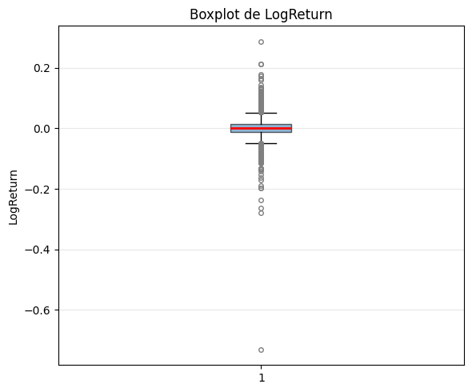
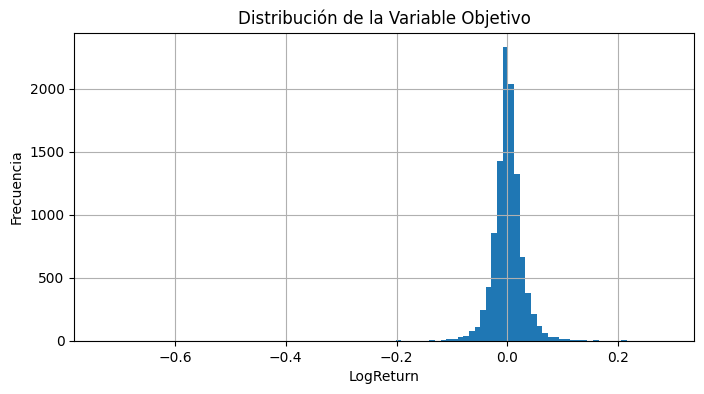
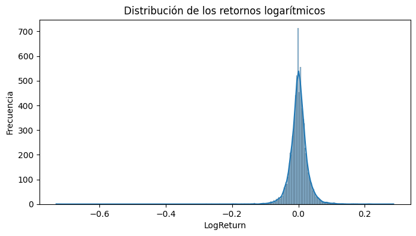

# Analisis Exploratorio de datos

Con el fin de complementar y actualizar el conjunto de datos original, se descargó información financiera adicional de de as acciones de APPEL (AAPL) desde a partir de la la librería `yfinance`, para el periodo comprendido entre el 18 de enero de 2025 y el 3 de abril de 2026.

Después de integrar la información, el conjunto de datos final contiene **10.473 registros**, correspondientes a **datos estructurados de series de tiempo financieras**, con un tamaño aproximado de **0.47 MB**.

Durante la revisión de calidad de los datos se identificó que:
- No existen valores faltantes en las variables originales (`Date`, `Open`, `High`, `Low`, `Close`, `Volume`).
- Se presenta un valor faltante en las variables `Return` y `LogReturn`, generado naturalmente por el cálculo del rezago temporal.
- Todas las variables presentan el tipo de dato esperado (`Timestamp` para fechas y `float` para variables numéricas).

Posteriormente, se calculó la variable objetivo **LogReturn**, definida como el retorno logarítmico diario del precio de cierre:

$LogReturn_t = \log\left(\frac{Close_t}{Close_{t-1}}\right)$

Una vez eliminados los valores nulos, se construyó un histograma de la variable objetivo para evaluar su distribución. Además, se calcularon las métricas de **asimetría (skewness)** y **curtosis (kurtosis)**, con el fin de analizar la forma de la distribución e identificar posibles desviaciones respecto a una distribución normal antes del entrenamiento del modelo. Se observa que la distribución de la variable objetivo que en nuestro caso es el logaritmo de los retornos no sigue una distribución normal puesto que el valor de la curtosis es mucho mayor a 3, alrededor de **55** y el coeficiente de asimetria es negativo **-1.93**, en consecuencia dicha distribución es leptocurtica. Lo cual no se puede modelar mediante la distribucion normal. Dentro del marco teorico de las distribuciones utilizadas para estos casos se encuentra la distribución Cauchy y modificaciones de la distribucion Beta.

## Visualización de la variable objetivo

### Boxplot
El diagrama de caja permite identificar la dispersión de los datos y posibles valores atípicos en la variable objetivo. Como es de esperarse es sesgada y de colas pesadas, particularmente a izquierda, debido a que en varios lapsos de tiempo de la serie temporal, se observaron importantes caidas en el precio de las acciones.

---

### Histograma básico
El histograma permite observar la distribución general de la variable `LogReturn`. 

---

### Histograma con curva KDE
El histograma con estimación No parametrica de la función de densidad (KDE), esta estimación permite visualizar con mayor detalle la forma de la distribución y su concentración, lo cual confirma lo dicho anteriormente respecto de la distribución leptocurtica de los datos.

