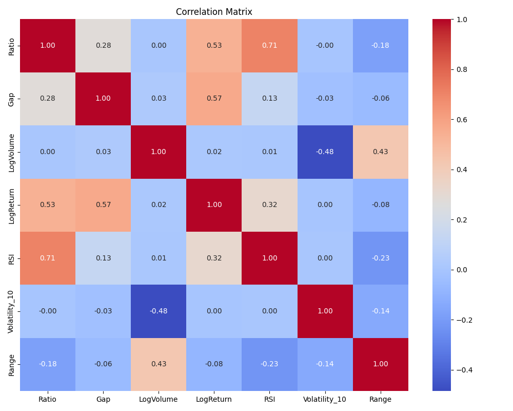
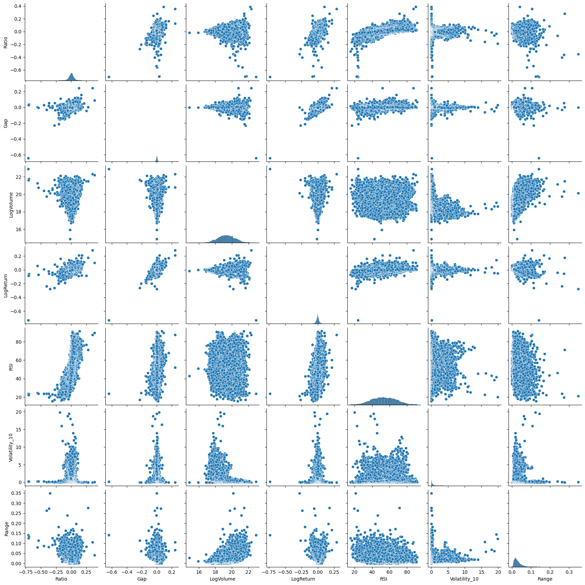

## Preprocesamiento y análisis de relaciones entre variables

Durante la etapa de preprocesamiento se realizaron transformaciones orientadas a mejorar la capacidad predictiva del modelo y a extraer información temporal relevante del comportamiento del activo financiero.

Inicialmente, se verificó la consistencia de las variables numéricas, validando tipos de datos, ausencia de duplicados y tratamiento de valores faltantes.Para nuestro caso particular, no habian valores faltantes, salvo aquellos que se pierden por el calculo de los log retornos calculados, definidos mediante la siguiente expresion: 

$r_t=log \left(\dfrac{P_t}{P_{t-1}}\right)$

Posteriormente, se calcularon nuevas variables derivadas a partir del precio de cierre, incluyendo **promedios móviles (Moving Averages)** de diferentes ventanas temporales (10 dias y 30 fias), ademas del indice de fuerza relativa definido como:
$RSI_t = 100 - \frac{100}{1 + RS_t}$ con el objetivo de capturar tendencias de corto, mediano y largo plazo en la serie.

Estas variables permiten suavizar la volatilidad diaria y facilitan la identificación de patrones persistentes en el comportamiento del mercado.

### 1. Volatilidad móvil (10 períodos)

La volatilidad se estimó como la desviación estándar móvil del precio de cierre en una ventana de 10 períodos:

$$
Volatility_{10,t} = \sqrt{\frac{1}{n-1}\sum_{i=0}^{n-1}(P_{t-i}-\bar{P})^2}, \quad n=10
$$

Esta variable permite medir la dispersión reciente del precio y cuantificar el nivel de riesgo del activo.

---

### 2. Rango relativo del precio

Se calculó el rango intradía como la diferencia entre el precio máximo y mínimo, normalizado por el precio de cierre:

$$
Range_t = \frac{High_t - Low_t}{Close_t}
$$

Este indicador refleja la amplitud de movimiento del precio dentro de cada jornada.

---

### 3. Volumen en escala logarítmica

Para reducir asimetrías en la distribución del volumen transado, se aplicó una transformación logarítmica:

$$
LogVolume_t = \log(Volume_t)
$$

Esta transformación mejora la estabilidad numérica y facilita el modelamiento.

---

### 4. Gap Overnight

El **Gap Overnight** mide el cambio del precio entre el cierre del día anterior y la apertura del día actual:

$$
Gap_t = \log(Open_t) - \log(Close_{t-1})
$$

Esta variable permite capturar movimientos ocurridos mientras el mercado se encontraba cerrado, generalmente asociados a noticias o eventos externos.

### 5.  Ratio

En lugar de utilizar directamente el precio de cierre, se introduce una variable derivada que captura información relativa respecto a la tendencia reciente, definida como:

$$ratio = \dfrac{Close}{SMA_{10}}$$

### Análisis de correlación

Como parte del análisis exploratorio posterior al preprocesamiento, se construyó una **matriz de correlación** entre la variable objetivo `LogReturn`, y range, volatilidad, RSI, log Volumen, GAP y ratio.

Este análisis permitió:

- Identificar variables con mayor asociación lineal con la variable objetivo.
- Detectar posibles problemas de **multicolinealidad** entre variables derivadas.

Se observa en general altas correlaciones, casi de 1, entre los log retornos y el ratio y GAP. como era esperada debido a su naturaleza de construccion a partir de estos. Mientras una muy baja correlacion entre el log volumen y y una correlacion del 0,32 entre el log retorno y RSI.; Y correlaciones inversas y bajas entre el log retorno y range.

### Matriz de correlación

---

### Análisis gráfico multivariado (Pair Plot)

Posteriormente, se construyó un **pair plot** para analizar visualmente las relaciones entre la variable objetivo y las variables transformadas.

Esta herramienta permitió observar:

- Distribución marginal de cada variable.
- Posibles relaciones lineales o no lineales.
- Presencia de valores atípicos.
- Agrupamientos o patrones temporales relevantes.
- Nivel de dispersión entre predictores.

El pair plot complementa el análisis de correlación al ofrecer una visión visual más detallada de la interacción entre variables.

Se observa como los log retornos tienen una posible asociacion lineal con las variables RATIO y GAP. Mientras que con el rango, esta asociacion no es clara.

### Pair Plot

---

### Conclusiones del preprocesamiento

A partir de este proceso se concluye que:

- Las variables derivadas capturan adecuadamente la dinámica temporal del activo.
- No se identificaron problemas críticos de calidad de datos.
- Existen relaciones significativas entre algunas variables explicativas y la variable objetivo, como por ejemplo: RATIO y GAP.
- El conjunto de datos quedó preparado para la fase de entrenamiento y validación del modelo predictivo.

